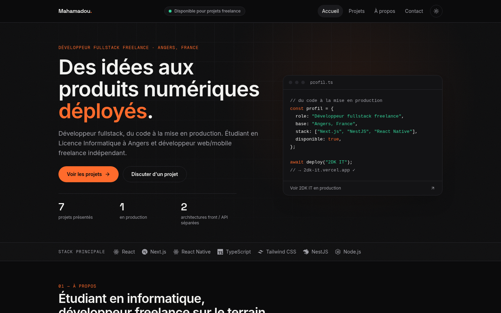
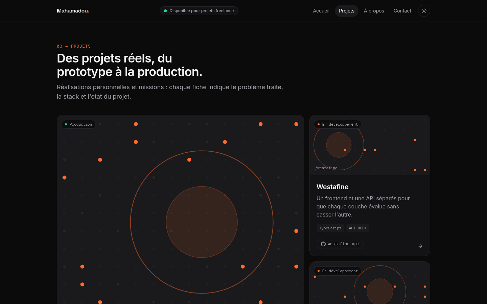
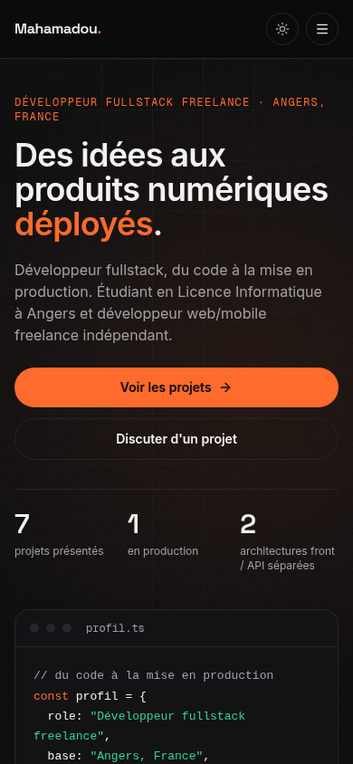
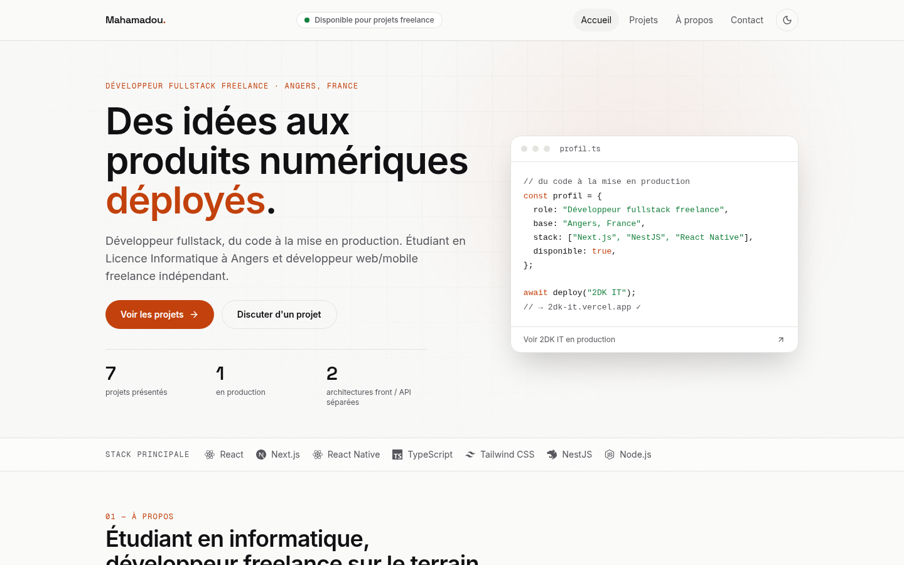

# Portfolio — Mahamadou Dembele

Portfolio de **Mahamadou Dembele**, développeur fullstack freelance et étudiant en Licence
Informatique à Angers : _des idées aux produits numériques déployés — du code à la mise en
production._

**Démo : [portfolio-one-chi-igpe905f4o.vercel.app](https://portfolio-one-chi-igpe905f4o.vercel.app)**



<!-- Captures générées depuis le site en production locale : à remplacer par de nouvelles
     captures après une évolution visuelle (mêmes noms de fichiers dans docs/screenshots/). -->

| Projets (bento grid)                                   | Mobile                                                  | Thème clair                                                      |
| ------------------------------------------------------ | ------------------------------------------------------- | ---------------------------------------------------------------- |
|  |  |  |

## Points clés

- **Contenu réel uniquement** : 7 projets, stack, parcours et services viennent de `src/data/` ;
  toute information manquante est marquée `TODO` dans les données, jamais inventée.
- **Design system dense et sobre** : thème sombre par défaut (bascule clair/sombre persistante),
  accent unique orange brûlé, bento grids, typographie Space Grotesk / Inter / Geist Mono.
- **Performance** : animations 100 % CSS (aucune librairie d'animation JS), composants serveur
  par défaut, pages statiques. Lighthouse local : 95–97 en performance mobile, 100 sur desktop,
  CLS 0.
- **Accessibilité** : axe-core sans violation (WCAG 2.2 AA) en thèmes clair et sombre, focus
  visible sur chaque élément, un `h1` par page, `prefers-reduced-motion` respecté.
- **SEO** : metadata complètes par page (Open Graph, Twitter Card, canonical), `sitemap.xml` et
  `robots.txt` dynamiques, données structurées JSON-LD `ProfilePage` / `Person`, image Open Graph
  1200×630.
- **Formulaire de contact fonctionnel** : validation Zod partagée client/serveur, envoi via
  [Resend](https://resend.com), champ piège anti-spam.

## Stack

| Domaine     | Choix                                                          |
| ----------- | -------------------------------------------------------------- |
| Framework   | Next.js 15 (App Router, Server Components), React 19           |
| Langage     | TypeScript strict (`noUncheckedIndexedAccess`)                 |
| Style       | Tailwind CSS v4 (tokens CSS dans `globals.css`), `next-themes` |
| Validation  | Zod                                                            |
| Icônes      | lucide-react, react-icons (logos des technologies)             |
| E-mails     | Resend (API HTTP, sans SDK)                                    |
| Qualité     | ESLint strict, Prettier, Husky + lint-staged, GitHub Actions   |
| Hébergement | Vercel (déploiement continu sur `master`)                      |

## Structure

```
src/
├── app/                    Routes (App Router)
│   ├── page.tsx            Accueil : hero + toutes les sections
│   ├── about/ projects/ contact/
│   ├── projects/[slug]/    Fiche projet (générée statiquement)
│   ├── api/contact/        Endpoint du formulaire (Zod + Resend)
│   ├── sitemap.ts robots.ts icon.svg template.tsx not-found.tsx
│   └── globals.css         Design tokens, animations, thème
├── components/
│   ├── layout/             Header, Navbar, MobileMenu, Footer, ThemeToggle…
│   ├── sections/           Hero, About, Skills, Projects, Experience, Contact
│   ├── projects/           Cartes, visuels, badges de statut, liens
│   ├── contact/            Formulaire
│   ├── motion/             Reveal (apparition au scroll en CSS)
│   └── seo/                JSON-LD
├── data/                   Source unique du contenu (site, projets, stack, parcours, services)
├── lib/                    Constantes, metadata, données structurées, utilitaires
└── types/                  Types du contenu
public/
├── og-image.png            Image Open Graph 1200×630
├── images/projects/        Captures des projets (<slug>-screenshot.png)
└── documents/              CV
```

## Démarrage

Prérequis : Node.js ≥ 20.9.

```bash
npm install
cp .env.example .env.local   # optionnel : nécessaire seulement pour envoyer des e-mails
npm run dev                  # http://localhost:3000
```

| Commande               | Rôle                           |
| ---------------------- | ------------------------------ |
| `npm run dev`          | Serveur de développement       |
| `npm run build`        | Build de production            |
| `npm run start`        | Sert le build de production    |
| `npm run lint`         | ESLint (0 warning toléré)      |
| `npm run typecheck`    | Vérification TypeScript        |
| `npm run format`       | Formatage Prettier             |
| `npm run format:check` | Vérification du formatage (CI) |

Un hook `pre-commit` (Husky + lint-staged) lint et formate les fichiers modifiés ; la CI GitHub
Actions lance lint, typecheck, format et build à chaque push et pull request.

## Variables d'environnement

| Variable               | Requise                 | Rôle                                                                   |
| ---------------------- | ----------------------- | ---------------------------------------------------------------------- |
| `RESEND_API_KEY`       | Oui, pour le formulaire | Clé API Resend. Sans elle, `/api/contact` répond 503.                  |
| `CONTACT_TO_EMAIL`     | Oui, pour le formulaire | Adresse qui reçoit les messages.                                       |
| `CONTACT_FROM_EMAIL`   | Non                     | Expéditeur vérifié dans Resend (défaut : `onboarding@resend.dev`).     |
| `NEXT_PUBLIC_SITE_URL` | Non                     | Domaine personnalisé. Sur Vercel, l'URL de production est automatique. |

## Modifier le contenu

Tout le texte affiché vient de `src/data/` :

- `site.ts` : identité, positionnement, disponibilité, réseaux (LinkedIn à compléter) ;
- `projects.ts` : projets, liens GitHub/démo, statut, stack ;
- `skills.ts`, `experience.ts`, `services.ts` : stack, parcours, offres.

Pour afficher la capture d'un projet, déposer `public/images/projects/<slug>-screenshot.png` :
elle remplace automatiquement l'illustration géométrique générée.

## Licence

Code source sous licence [MIT](LICENSE). Les contenus personnels (textes, informations de profil,
captures, CV) restent la propriété de Mahamadou Dembele et ne sont pas couverts par cette licence.
